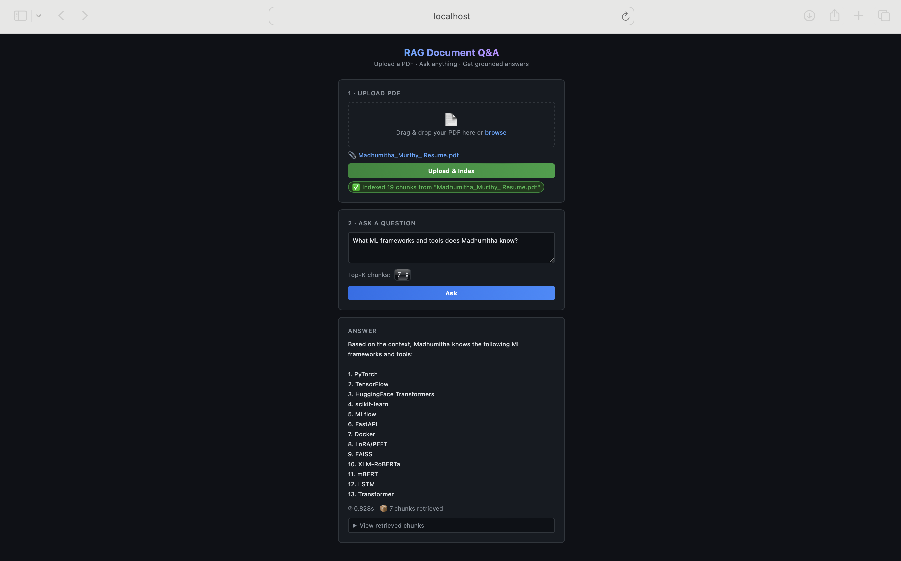

# RAG-Powered Document Q&A API

A production-ready REST API that lets you upload any PDF and ask natural language questions about it — answers are grounded in your document using **Retrieval-Augmented Generation (RAG)**.


---

## Demo

> Upload any PDF, ask questions, get grounded answers — all from the browser.



---

## What It Does

1. **Upload** a PDF → text is extracted, chunked, and embedded into a FAISS vector store
2. **Ask** a natural language question → relevant chunks are retrieved and passed to Groq's Llama 3.3 70B
3. **Receive** a grounded answer with source chunks and response latency

The included **web UI** (dark theme) lets you do all of this from a browser without touching the API directly.

---

## Architecture

```
PDF Upload
    │
    ▼
pdfplumber (text extraction)
    │
    ▼
Section-aware chunking           ← splits by section headers, NL context prefix per chunk
    │
    ▼
HuggingFace all-MiniLM-L6-v2   ← 384-dim sentence embeddings
    │
    ▼
FAISS IndexFlatL2               ← persisted vector store
    │
    ▼
AWS S3 (optional)               ← durable backup (index + chunks + PDF)
    │
    ▼  (at query time: top-k similarity search; loads from S3 if not local)
    │
LangChain RAG Pipeline
    │
    ▼
Groq Llama 3.3-70B-versatile   ← temp=0.2 for deterministic answers
    │
    ▼
JSON Response  { answer, retrieved_chunks, latency_seconds }
```

---

## Tech Stack

| Layer | Technology |
|---|---|
| API Framework | FastAPI + Uvicorn |
| PDF Parsing | pdfplumber |
| Embeddings | HuggingFace `all-MiniLM-L6-v2` (sentence-transformers) |
| Vector Store | FAISS (IndexFlatL2) |
| LLM | Groq `llama-3.3-70b-versatile` |
| Orchestration | LangChain, LangChain-Groq |
| Experiment Tracking | MLflow |
| Containerization | Docker + Docker Compose |
| Frontend | Vanilla JS (dark-theme web UI, no framework) |
| Durable Storage | AWS S3 (index, chunks, and PDF backup) |

---

## Quick Start

### Option A — Local

```bash
# 1. Clone and install
git clone https://github.com/madhumitha-murthy/rag-document-qa
cd rag-document-qa
pip install -r requirements.txt

# 2. Create a .env file from the example and fill in your keys
cp .env.example .env
# Edit .env — GROQ_API_KEY is required; AWS_S3_BUCKET is optional (local index used if not set)

# 3. Start the server
uvicorn app.main:app --reload
```

- **API + Web UI:** http://localhost:8000
- **Swagger Docs:** http://localhost:8000/docs

### Option B — Docker

```bash
docker-compose up --build
```

Set AWS credentials via environment variables or attach an EC2 IAM role with S3 access.

- **API + Web UI:** http://localhost:8000
- **MLflow UI:** http://localhost:5000

---

## API Reference

### `POST /upload` — Index a PDF

```bash
curl -X POST http://localhost:8000/upload \
  -F "file=@your_document.pdf"
```

**Response:**
```json
{
  "message": "PDF uploaded and indexed successfully.",
  "filename": "your_document.pdf",
  "num_chunks": 42
}
```

---

### `POST /query` — Ask a Question

```bash
curl -X POST http://localhost:8000/query \
  -H "Content-Type: application/json" \
  -d '{"question": "What is the main topic?", "top_k": 3}'
```

**Response:**
```json
{
  "answer": "The document covers...",
  "retrieved_chunks": ["chunk 1 text...", "chunk 2 text...", "chunk 3 text..."],
  "latency_seconds": 2.14
}
```

| Parameter | Type | Default | Description |
|---|---|---|---|
| `question` | string | required | Natural language question about the uploaded PDF |
| `top_k` | integer | 3 | Number of document chunks to retrieve (3, 5, or 7) |

---

## Experiment Tracking (MLflow)

Run and compare different retrieval configurations to evaluate answer quality and latency:

```bash
# Place a test PDF at faiss_index/test.pdf, then run:
python experiments/run_experiments.py

# Open results dashboard
mlflow ui   # → http://localhost:5000
```

Tracked metrics per run: `latency_seconds`, `answer_length_chars`, `num_chunks_retrieved`, `retrieval_score` (avg FAISS L2 distance — lower is better), `keyword_recall` (fraction of expected keywords found in the answer)

Each question in the experiment has a set of expected keywords. `keyword_recall` is the average fraction of those keywords that appear in the model's answer across all 5 test questions.

| Config | chunk_size | top_k | Avg Latency | Keyword Recall | Retrieval Score | Notes |
|---|---|---|---|---|---|---|
| config_1 | 500 | 3 | 0.671s | 28% | **0.96** | Baseline |
| config_2 | 1000 | 3 | **0.503s** | 52% | 1.11 | Best latency |
| config_3 | 500 | 5 | 0.626s | **64%** | 1.01 | Best recall |

> Retrieval score = avg FAISS L2 distance (lower = more relevant chunks retrieved). config_2 achieves the best latency at 52% recall; config_3 achieves the highest recall (64%) by retrieving more chunks per query. Chunking uses section-aware splitting with natural language context prefixes to improve retrieval precision.

---

## Project Structure

```
rag-document-qa/
├── app/
│   ├── main.py              # FastAPI app — /upload and /query endpoints
│   ├── pdf_processor.py     # PDF text extraction and section-aware chunking
│   ├── embeddings.py        # Sentence Transformer embeddings (cached)
│   ├── vector_store.py      # FAISS index build, persist, search + S3 fallback
│   ├── rag_pipeline.py      # LangChain RAG chain + Groq LLM integration
│   ├── mlflow_tracker.py    # Experiment logging helpers
│   ├── s3_utils.py          # AWS S3 upload/download helpers
│   └── static/
│       └── index.html       # Dark-theme web UI (drag & drop, real-time feedback)
├── docs/
│   └── screenshot.png       # Web UI screenshot
├── experiments/
│   └── run_experiments.py   # MLflow experiment runner (3 configs)
├── tests/
│   ├── test_pdf_processor.py
│   ├── test_embeddings.py
│   └── test_rag_pipeline.py
├── .github/workflows/ci.yml # CI — runs tests on every push
├── Dockerfile
├── docker-compose.yml       # API + MLflow UI services
├── requirements.txt
└── .env                     # Environment variables (not committed)
```

---

## Configuration

Create a `.env` file in the project root:

```env
# Required
GROQ_API_KEY=your_groq_api_key_here

# Optional — S3 for durable cross-session storage (index + PDF backup)
# If not set, the FAISS index is stored locally only
AWS_S3_BUCKET=your_s3_bucket_name
AWS_S3_PREFIX=rag-qa              # S3 key prefix, defaults to "rag-qa"
AWS_ACCESS_KEY_ID=your_key
AWS_SECRET_ACCESS_KEY=your_secret
AWS_DEFAULT_REGION=us-east-1
```

- Get a free Groq API key at [console.groq.com](https://console.groq.com).
- S3 credentials are read from the standard AWS credential chain (env vars, `~/.aws/credentials`, or EC2 IAM role).
- The API works fully without AWS — S3 upload is skipped gracefully if credentials are not set.
